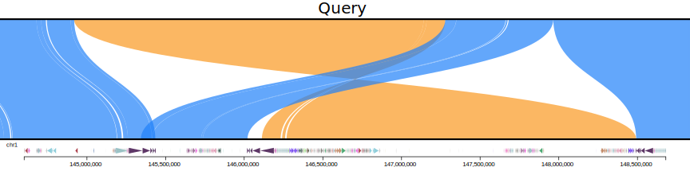

# rustybam

[](https://github.com/mrvollger/rustybam/actions)
[](https://github.com/mrvollger/rustybam/actions)
[](https://github.com/mrvollger/rustybam/actions)

[](https://anaconda.org/bioconda/rustybam)
[](https://anaconda.org/bioconda/rustybam)

[](https://crates.io/crates/rustybam)
[](https://crates.io/crates/rustybam)

[](https://zenodo.org/badge/latestdoi/351639424)

`rustybam` is a bioinformatics toolkit written in the `rust` programing language focused around manipulation of alignment (`bam` and `PAF`), annotation (`bed`), and sequence (`fasta` and `fastq`) files.

## What can rustybam do?

Here is a commented example that highlights some of the better features of `rustybam`, and demonstrates how each result can be read directly into another subcommand.

```bash
rb trim-paf .test/asm_small.paf `#trims back alignments that align the same query sequence more than once` \
    | rb break-paf --max-size 100 `#breaks the alignment into smaller pieces on indels of 100 bases or more` \
    | rb orient `#orients each contig so that the majority of bases are forward aligned` \
    | rb liftover --bed <(printf "chr22\t12000000\t13000000\n") `#subsets and trims the alignment to 1 Mbp of chr22.` \
    | rb filter --paired-len 10000 `#filters for query sequences that have at least 10,000 bases aligned to a target across all alignments.` \
    | rb stats --paf `#calculates statistics from the trimmed paf file` \
    | less -S
```

## Usage

```shell
rustybam [OPTIONS] <SUBCOMMAND>
```

or

```shell
rb [OPTIONS] <SUBCOMMAND>
```

### Subcommands

The full manual of subcommands can be found on the [docs](https://docs.rs/rustybam/latest/rustybam/cli/enum.Commands.html).

```shell
SUBCOMMANDS:
    stats          Get percent identity stats from a sam/bam/cram or PAF
    bed-length     Count the number of bases in a bed file [aliases: bedlen, bl, bedlength]
    filter         Filter PAF records in various ways
    invert         Invert the target and query sequences in a PAF along with the CIGAR string
    liftover       Liftover target sequence coordinates onto query sequence using a PAF
    trim-paf       Trim paf records that overlap in query sequence [aliases: trim, tp]
    orient         Orient paf records so that most of the bases are in the forward direction
    break-paf      Break PAF records with large indels into multiple records (useful for
                   SafFire) [aliases: breakpaf, bp]
    paf-to-sam     Convert a PAF file into a SAM file. Warning, all alignments will be marked as
                   primary! [aliases: paftosam, p2s, paf2sam]
    fasta-split    Reads in a fasta from stdin and divides into files (can compress by adding
                   .gz) [aliases: fastasplit, fasplit]
    fastq-split    Reads in a fastq from stdin and divides into files (can compress by adding
                   .gz) [aliases: fastqsplit, fqsplit]
    get-fasta      Mimic bedtools getfasta but allow for bgzip in both bed and fasta inputs
                   [aliases: getfasta, gf]
    nucfreq        Get the frequencies of each bp at each position
    repeat         Report the longest exact repeat length at every position in a fasta
    suns           Extract the intervals in a genome (fasta) that are made up of SUNs
    help           Print this message or the help of the given subcommand(s)
```

## Install

### conda

```shell
mamba install -c bioconda rustybam
```

### cargo

```shell
cargo install rustybam
```

### Pre-complied binaries

Download from [releases](https://github.com/mrvollger/rustybam/releases) (may be slower than locally complied versions).

### Source

```shell
git clone https://github.com/mrvollger/rustybam.git
cd rustybam
cargo build --release
```

and the executables will be built here:

```shell
target/release/{rustybam,rb}
```

## Examples

### PAF or BAM statistics

For BAM files with extended cigar operations we can calculate statistics about the aliment and report them in BED format.

```shell
rustybam stats {input.bam} > {stats.bed}
```

The same can be done with PAF files as long as they are generated with `-c --eqx`.

```shell
rustybam stats --paf {input.paf} > {stats.bed}
```

### PAF liftovers

> I have a `PAF` and I want to subset it for just a particular region in the reference.

With `rustybam` its easy:

```shell
rustybam liftover \
     --bed <(printf "chr1\t0\t250000000\n") \
     input.paf > trimmed.paf
```

> But I also want the alignment statistics for the region.

No problem, `rustybam liftover` does not just trim the coordinates but also the CIGAR
so it is ready for `rustybam stats`:

```shell
rustybam liftover \
    --bed <(printf "chr1\t0\t250000000\n") \
    input.paf \
    | rustybam stats --paf \
    > trimmed.stats.bed
```

> Okay, but Evan asked for an "align slider" so I need to realign in chunks.

No need, just make your `bed` query to `rustybam liftoff` a set of sliding windows
and it will do the rest.

```shell
rustybam liftover \
    --bed <(bedtools makewindows -w 100000 \
        <(printf "chr1\t0\t250000000\n") \
        ) \
    input.paf \
    | rustybam stats --paf \
    > trimmed.stats.bed
```

You can also use `rustybam breakpaf` to break up the paf records of indels above a certain size to
get more "miropeats" like intervals.

```shell
rustybam breakpaf --max-size 1000 input.paf \
    | rustybam liftover \
    --bed <(printf "chr1\t0\t250000000\n") \
    | ./rustybam stats --paf \
    > trimmed.stats.bed
```

> Yeah but how do I visualize the data?

Try out
[SafFire](https://mrvollger.github.io/SafFire/)!

### Align once

At the boundaries of CNVs and inversions minimap2 may align the same section of query sequence to multiple stretches of the target sequence. This utility uses the CIGAR (must use `--eqx`) strings of PAF alignments to determine an optimal split of the alignments such no query base is aligned more than once. To do this the whole PAF file is loaded in memory and then overlaps are removed starting with the largest overlapping interval and iterating.

```bash
rb trim-paf {input.paf} > {trimmed.paf}
```

Here is an example from the NOTCH2NL region comparing CHM1 against CHM13 before trimming:


and after trimming


### Split fastx files

Split a fasta file between `stdout` and two other files both compressed and uncompressed.

```shell
cat {input.fasta} | rustybam fasta-split two.fa.gz three.fa
```

Split a fastq file between `stdout` and two other files both compressed and uncompressed.

```shell
cat {input.fastq} | rustybam fastq-split two.fq.gz three.fq
```

### Extract from a fasta

This tools is designed to mimic `bedtools getfasta` but this tools allows the fasta to be `bgzipped`.

```shell
samtools faidx {seq.fa(.gz)}
rb get-fasta --name --strand --bed {regions.of.interest.bed} --fasta {seq.fa(.gz)}
```

## TODO

- [x] Finish implementing `trim-paf`.
- [x] Add a `bedtools getfasta` like operation that actually works with bgzipped input.
  - [ ] implement bed12/split
- [ ] Allow sam or paf for operations:
  - [x] make a sam header from a PAF file
  - [ ] convert sam record to paf record
  - [x] convert paf record to sam record
- [ ] Add `D4` for Nucfreq.
- [ ] Finish implementing `suns`.
